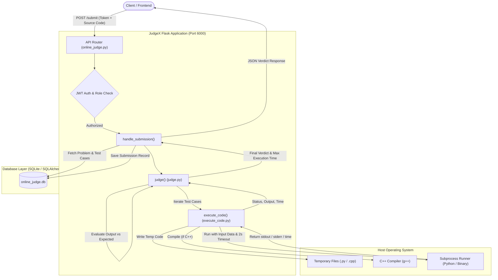
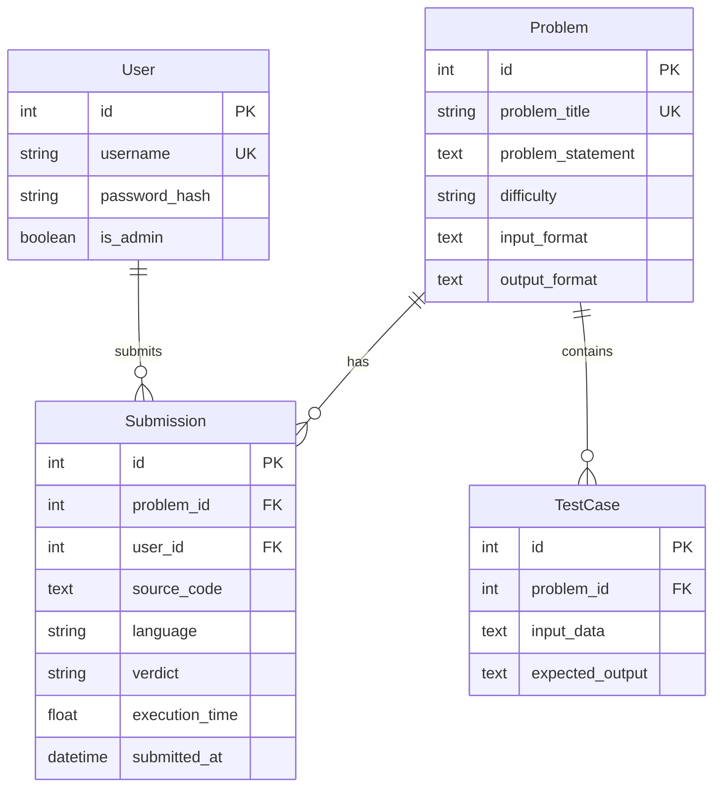

# ⚡ JudgeX Backend

[](https://www.python.org/)
[](https://flask.palletsprojects.com/)
[](https://www.sqlalchemy.org/)
[](https://pyjwt.readthedocs.io/)
[](https://isocpp.org/)

**JudgeX Backend** is a lightweight, extensible RESTful Online Judge system built with Python and Flask. It provides an automated evaluation pipeline that compiles, executes, and assesses user-submitted source code against predefined test cases, returning competitive programming-style verdicts (`Accepted`, `Wrong Answer`, `Time Limit Exceeded`, `RunTime Error`, `Compilation ERROR`).

---

## 📑 Table of Contents

- [Features](#-features)
- [System Architecture](#-system-architecture)
- [Database Schema](#-database-schema)
- [Code Execution & Judging Pipeline](#-code-execution--judging-pipeline)
- [API Reference](#-api-reference)
  - [Authentication](#authentication)
  - [Problems Management](#problems-management)
  - [Submissions](#submissions)
  - [Users](#users)
- [Quickstart & Installation](#-quickstart--installation)
  - [Prerequisites](#prerequisites)
  - [Setup Guide](#setup-guide)
- [API Usage Examples (cURL)](#-api-usage-examples-curl)
- [Project Directory Structure](#-project-directory-structure)
- [Security Considerations & Production Roadmap](#-security-considerations--production-roadmap)
- [License](#-license)

---

## 🚀 Features

- **User Authentication & Authorization**: Secure user registration and login using Werkzeug password hashing and JSON Web Tokens (JWT HS256).
- **Role-Based Access Control**: Granular permissions distinguishing between regular contestants and administrators.
- **Problem & Testcase Management**: Admin endpoints to publish programming problems with metadata (difficulty, format descriptions) and associate multiple test cases.
- **Multi-Language Judging Engine**: Native support for **Python 3** and **C++** (compiled via `g++`).
- **Real-Time Execution Benchmarks**: Measures execution wall time for submissions and enforces strict execution timeouts (2 seconds).
- **Detailed Evaluation Verdicts**:
  - `Accepted` (AC)
  - `Wrong Answer` (WA)
  - `Time Limit Exceeded` (TLE)
  - `RunTime Error` (RTE)
  - `Compilation ERROR` (CE)
- **Automatic Resource Cleanup**: Safe creation and teardown of temporary source code files and compiled executables across Windows and Unix-like operating systems.

---

## 🏛 System Architecture

The following diagram illustrates the lifecycle of an incoming submission through the judging pipeline:



---

## 🗄 Database Schema

The database is built on SQLAlchemy ORM and consists of four primary models:



### Models Overview

| Model | Table Name | Description |
| :--- | :--- | :--- |
| **`User`** | `user` | Stores registered user credentials and administrative role flag. |
| **`Problem`** | `problems` | Stores problem title, description, difficulty rating, and I/O specifications. |
| **`TestCase`** | `test_cases` | Stores input datasets and corresponding expected outputs for verification. |
| **`Submission`** | `submissions` | Logs code submissions, language used, execution time, timestamp, and evaluation verdict. |

---

## ⚙ Code Execution & Judging Pipeline

Code execution is isolated per submission inside [`execute_code.py`](file:///d:/projects/online_judge/execute_code.py):

1. **Temporary File Generation**: Source code is written to an ephemeral file (`tempfile.NamedTemporaryFile`).
2. **Compilation (C++)**:
   - Compiled with `g++ <source>.cpp -o <binary>`.
   - If compilation fails, the stderr log is captured and `COMPILATION_ERROR` is returned immediately.
3. **Execution & Sandboxing Bounds**:
   - Run via `subprocess.run` with a hard timeout of **2.0 seconds**.
   - Input data is passed directly via `stdin`.
   - Captures `stdout` and `stderr` independently.
4. **Outcome Evaluation**:
   - **Timeout**: Returns `TIME_LIMIT_EXCEEDED`.
   - **Non-zero exit code**: Returns `RUNTIME_ERROR`.
   - **Zero exit code**: Compares trimmed `stdout` against `expected_output.strip()`.
5. **Cleanup**: Ephemeral `.py`, `.cpp`, and `.exe` or compiled binaries are deleted inside a `finally` block to prevent disk bloat.

---

## 📡 API Reference

All responses are returned in JSON format. Authenticated endpoints require the HTTP header:
```http
Authorization: Bearer <your_jwt_token>
```

### Authentication

#### 1. Register User
- **URL**: `/register`
- **Method**: `POST`
- **Auth Required**: No
- **Body Parameters**:
  ```json
  {
    "username": "coder123",
    "password": "secretpassword",
    "is_admin": false
  }
  ```
  *(Note: Setting username to `"admin"` automatically grants administrative privileges)*
- **Response `201 Created`**:
  ```json
  {
    "message": "User successfully added"
  }
  ```

#### 2. Login
- **URL**: `/login`
- **Method**: `POST`
- **Auth Required**: No
- **Body Parameters**:
  ```json
  {
    "username": "coder123",
    "password": "secretpassword"
  }
  ```
- **Response `200 OK`**:
  ```json
  {
    "uId": 1,
    "token": "eyJhbGciOiJIUzI1NiIsInR5cCI6IkpXVCJ9...",
    "isAdmin": false
  }
  ```

---

### Problems Management

#### 3. List All Problems
- **URL**: `/problems`
- **Method**: `GET`
- **Auth Required**: No
- **Response `200 OK`**:
  ```json
  {
    "problems": [
      {
        "id": 1,
        "problem_title": "Sum of Two Numbers",
        "problem_statement": "Given two integers a and b, print their sum.",
        "difficulty": "Easy",
        "input_format": "Two space-separated integers",
        "output_format": "Single integer representing sum",
        "test_case_ids": [1, 2],
        "submission_ids": [10, 11]
      }
    ]
  }
  ```

#### 4. Create Problem
- **URL**: `/problems`
- **Method**: `POST`
- **Auth Required**: **Yes (Admin Only)**
- **Body Parameters**:
  ```json
  {
    "problem_title": "Sum of Two Numbers",
    "problem_statement": "Given two integers a and b, print their sum.",
    "difficulty": "Easy",
    "input_format": "Two integers a and b",
    "output_format": "The sum a + b"
  }
  ```
- **Response `200 OK`**:
  ```json
  {
    "message": "Problem Successfully added",
    "problem_id": 1
  }
  ```

#### 5. Add Test Case to Problem
- **URL**: `/problems/<int:problem_id>/testcases`
- **Method**: `POST`
- **Auth Required**: **Yes (Admin Only)**
- **Body Parameters**:
  ```json
  {
    "input_data": "3 5\n",
    "expected_output": "8"
  }
  ```
- **Response `200 OK`**:
  ```json
  {
    "message": "TestCase successfully added to the problem"
  }
  ```

---

### Submissions

#### 6. Submit Solution
- **URL**: `/submit`
- **Method**: `POST`
- **Auth Required**: **Yes (Contestant or Admin)**
- **Body Parameters**:
  ```json
  {
    "problem_id": 1,
    "source_code": "a, b = map(int, input().split())\nprint(a + b)",
    "language": "python"
  }
  ```
  *(Supported `language` options: `"python"`, `"cpp"`)*
- **Response `200 OK`**:
  ```json
  {
    "status": "success",
    "verdict": "Accepted",
    "execution_time": 0.04523
  }
  ```

---

### Users

#### 7. List Users
- **URL**: `/users`
- **Method**: `GET`
- **Auth Required**: No
- **Response `200 OK`**:
  ```json
  {
    "users": [
      {
        "id": 1,
        "username": "admin",
        "is_admin": true
      }
    ]
  }
  ```

---

## 🛠 Quickstart & Installation

### Prerequisites

1. **Python 3.10+** installed on your system.
2. **GCC / G++ Compiler**: Ensure `g++` is installed and available in your system `$PATH` for compiling C++ submissions.
   - **Ubuntu/Debian**: `sudo apt install build-essential`
   - **macOS**: `xcode-select --install`
   - **Windows**: Install [MinGW-w64](https://www.mingw-w64.org/) or [MSYS2](https://www.msys2.org/) and add `bin` to `Path`.

### Setup Guide

1. **Clone the Repository**:
   ```bash
   git clone https://github.com/AgrHarsh27/JudgeX-Backend.git
   cd JudgeX-Backend
   ```

2. **Create and Activate a Virtual Environment**:
   - On **Linux / macOS**:
     ```bash
     python3 -m venv venv
     source venv/bin/activate
     ```
   - On **Windows (PowerShell)**:
     ```powershell
     python -m venv venv
     .\venv\Scripts\Activate.ps1
     ```

3. **Install Dependencies**:
   ```bash
   pip install -r requirements.txt
   ```

4. **Run the Application**:
   ```bash
   python online_judge.py
   ```
   The server will start at:
   ```
   * Running on http://127.0.0.1:6000
   * Running on http://<your-lan-ip>:6000
   ```

---

## 💻 API Usage Examples (cURL)

### 1. Register & Login as Admin
```bash
# Register admin user
curl -X POST http://localhost:6000/register \
  -H "Content-Type: application/json" \
  -d '{"username": "admin", "password": "adminpassword", "is_admin": true}'

# Login to receive JWT token
curl -X POST http://localhost:6000/login \
  -H "Content-Type: application/json" \
  -d '{"username": "admin", "password": "adminpassword"}'
```

### 2. Add Problem (Using Bearer Token)
```bash
curl -X POST http://localhost:6000/problems \
  -H "Authorization: Bearer <YOUR_TOKEN_HERE>" \
  -H "Content-Type: application/json" \
  -d '{
    "problem_title": "Sum of Two Numbers",
    "problem_statement": "Given two numbers a and b, output a + b.",
    "difficulty": "Easy",
    "input_format": "a b",
    "output_format": "sum"
  }'
```

### 3. Add Test Case
```bash
curl -X POST http://localhost:6000/problems/1/testcases \
  -H "Authorization: Bearer <YOUR_TOKEN_HERE>" \
  -H "Content-Type: application/json" \
  -d '{
    "input_data": "10 20\n",
    "expected_output": "30"
  }'
```

### 4. Submit Python Solution
```bash
curl -X POST http://localhost:6000/submit \
  -H "Authorization: Bearer <YOUR_TOKEN_HERE>" \
  -H "Content-Type: application/json" \
  -d '{
    "problem_id": 1,
    "language": "python",
    "source_code": "a, b = map(int, input().split())\nprint(a + b)"
  }'
```

### 5. Submit C++ Solution
```bash
curl -X POST http://localhost:6000/submit \
  -H "Authorization: Bearer <YOUR_TOKEN_HERE>" \
  -H "Content-Type: application/json" \
  -d '{
    "problem_id": 1,
    "language": "cpp",
    "source_code": "#include <iostream>\nusing namespace std;\nint main() { int a, b; if (cin >> a >> b) cout << (a + b) << endl; return 0; }"
  }'
```

---

## 📂 Project Directory Structure

```text
JudgeX-Backend/
│
├── online_judge.py      # Flask application entry point, route definitions & submission handler
├── models.py            # SQLAlchemy database models (User, Problem, TestCase, Submission)
├── judge.py             # Judging orchestrator, testcase loop & verdict determination
├── execute_code.py      # Low-level code runner (temporary file management, compilation, timeout handling)
├── requirements.txt     # Python package dependencies
├── .gitignore           # Git ignore rules for virtual environments, caches, and database files
└── README.md            # Project documentation and API guide
```

---

## 🔒 Security Considerations & Production Roadmap

> [!CAUTION]
> **Host Execution Notice**: In this current developmental architecture, submitted code executes directly in the host OS environment using `subprocess.run`. For production deployments, untrusted code execution **must** be isolated inside secure sandboxes.

### Recommended Production Enhancements:
1. **Sandboxed Code Execution**:
   - Wrap worker execution in Docker containers or utilize containerized isolation tools such as [nsjail](https://github.com/google/nsjail), [isolate](https://github.com/ioi/isolate), or [gVisor](https://github.com/google/gvisor).
   - Enforce memory ceilings (e.g. 256MB), disable network egress, and drop root capabilities.
2. **Asynchronous Task Queue**:
   - Migrate code judging from the synchronous Flask request-response cycle to background workers via **Celery** or **Redis Queue (RQ)**.
   - Utilize WebSockets or polling for live verdict updates.
3. **Configuration & Secrets**:
   - Move `SECRET_KEY` and database URLs to environment variables using `python-dotenv`.
4. **Database Migration**:
   - Integrate `Flask-Migrate` (Alembic) for structured schema migrations and switch SQLite to PostgreSQL for high concurrency.

---

## 📜 License

This project is licensed under the [MIT License](LICENSE).
